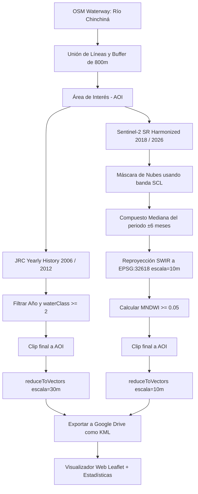

# Guía Metodológica: Mapeo Multitemporal del Río Chinchiná (2006–2026)

Este documento detalla la metodología científica, el pipeline de procesamiento de datos geoespaciales en **Google Earth Engine (GEE)** y el sistema de visualización interactiva para el análisis del cauce del **Río Chinchiná (Caldas, Colombia)**. Ha sido estructurado para servir como base académica y soporte para proyectos de investigación.

---

## 1. Introducción y Contexto Geográfico

El **Río Chinchiná** es una corriente de agua de carácter torrencial y alta montaña ubicada en el departamento de Caldas, Colombia. Su cuenca abarca aproximadamente **1,052 km²** y es de vital importancia socioeconómica y ambiental:
*   **Nacimiento:** En las inmediaciones del Parque Nacional Natural Los Nevados (confluencia de cuencas glaciares cerca al Nevado del Ruiz) a más de **3,600 m s.n.m.**
*   **Desembocadura:** En el Río Cauca (sector de Arauca, Palestina) a **800 m s.n.m.**, con una longitud de cauce principal de aproximadamente **69 km** [32].
*   **Importancia:** Abastece de agua potable a más de 500,000 personas (Manizales, Villamaría, Chinchiná, Palestina) y soporta la infraestructura hidroeléctrica de la CHEC y la economía cafetera de la región.
*   **Riesgos:** La cuenca está expuesta a amenazas naturales complejas como flujos de lodo (lahares) por actividad del Volcán Nevado del Ruiz (ej. la catástrofe de 1985 y avenidas torrenciales en 2011), deslizamientos y crecientes súbitas debido a su pronunciada pendiente promedio.

> [!IMPORTANT]
> **El Reto Técnico:** El cauce activo del Río Chinchiná en su cuenca media y baja oscila entre **20 y 60 metros** de ancho. En imágenes de satélite tradicionales (como Landsat con resolución de 30m), el río suele ocupar solo uno o dos píxeles de ancho, lo que genera problemas de **mezcla de píxeles** (agua mezclada con vegetación o suelo en las orillas) y sombras de montaña que distorsionan las firmas espectrales [16].

---

## 2. Metodología de Teledetección Espectral

Para resolver las limitaciones de resolución espacial y cobertura histórica, se adoptó una metodología híbrida que combina datos de archivo del Centro Común de Investigación de la Comisión Europea (JRC) [34] y satélites de última generación (Sentinel-2) [10].

### Comparativa de Sensores y Datos

| Parámetro | Periodo Histórico (2006, 2012) | Periodo Reciente (2018, 2026) |
| :--- | :--- | :--- |
| **Fuente de Datos** | JRC Yearly Water History v1.4 [34] | Copernicus Sentinel-2 MSI [10] |
| **Satélites** | Landsat 5 TM / Landsat 7 ETM+ | Sentinel-2A / Sentinel-2B |
| **Resolución Espacial**| 30 metros | 10 metros (bandas visibles/NIR) |
| **Método de Extracción**| Historial de clasificación climatológica | Índice Espectral MNDWI [31] |
| **Corrección** | Clasificación estacional/permanente integrada | Reproyección UTM Zona 18N (EPSG:32618) |

---

### El Índice de Agua: MNDWI
Para el periodo moderno (2018–2026), se calculó el **Índice de Agua de Diferencia Normalizada Modificado (MNDWI)** [31]. A diferencia del NDWI clásico (que usa la banda del Infrarrojo Cercano - NIR), el MNDWI reemplaza la banda NIR por la banda del **Infrarrojo de Onda Corta (SWIR)**.

La fórmula matemática es:

$$\text{MNDWI} = \frac{\text{Green} - \text{SWIR}}{\text{Green} + \text{SWIR}}$$

En el caso de **Sentinel-2**:
*   $\text{Green} = \text{Banda 3}$ (560 nm, resolución de 10m).
*   $\text{SWIR} = \text{Banda 11}$ (1610 nm, resolución de 20m resampleada a 10m) [10].

#### Justificación Científica del MNDWI:
1.  **Atenuación de Ruido en Sombras:** En la topografía abrupta de la cordillera andina de Caldas, las sombras de las montañas absorben la luz de manera similar al agua en las bandas visibles. Sin embargo, en la banda SWIR, el suelo y la vegetación reflejan con mucha mayor intensidad que el agua, lo que permite separar claramente los ríos de las sombras topográficas [31].
2.  **Sensibilidad a Sedimentos:** El Río Chinchiná transporta una gran cantidad de sedimentos suspendidos (ceniza volcánica, limos). El MNDWI es más estable y menos propenso a omitir aguas cargadas de sedimentos que otros índices.
3.  **Umbral de Clasificación:** Se determinó experimentalmente un umbral óptimo de **MNDWI $\ge$ 0.05** (o **0.10** en mapeos de alta selectividad) para clasificar el píxel como agua activa [31].

### Delineación Espectral de la Reflectancia Mixta en Fronteras (Píxel Mixto)

La variación en las áreas de detección del cauce obtenidas entre los sensores (Landsat frente a Sentinel-2) se explica físicamente a través del fenómeno del **píxel mixto (mixel)** [16]. En un río de montaña estrecho como el Chinchiná (ancho de 20–60 m), la firma espectral registrada en cada celda es una combinación ponderada de las reflectancias de los materiales presentes en la superficie del píxel.

La ecuación matemática que describe este comportamiento espectral es:

$$\rho_{\text{compuesta}}(\lambda) = f_{\text{agua}} \cdot \rho_{\text{agua}}(\lambda) + (1 - f_{\text{agua}}) \cdot \rho_{\text{ribera}}(\lambda)$$

Donde:
*   $\rho_{\text{compuesta}}(\lambda)$ es la reflectancia espectral integrada registrada por el sensor a una longitud de onda $\lambda$.
*   $f_{\text{agua}}$ es la fracción de ocupación espacial del agua dentro del píxel ($0.0 \le f_{\text{agua}} \le 1.0$).
*   $\rho_{\text{agua}}(\lambda)$ es la reflectancia espectral pura del agua.
*   $\rho_{\text{ribera}}(\lambda)$ es la reflectancia espectral pura de los componentes terrestres limítrofes (vegetación, suelo desnudo, rocas).

#### Implicación Física de la Ecuación en el Mapeo:
1.  **Falsa Invisibilidad en Landsat (30 m):** Al tener un píxel de 30 m × 30 m ($900\text{ m}^2$), la fracción de agua $f_{\text{agua}}$ en la cuenca media y alta del río Chinchiná suele ser menor a $0.3$. Como la reflectancia de la vegetación de la ribera es dominante, el espectro compuesto resultante $\rho_{\text{compuesta}}$ cae por debajo del umbral de clasificación de agua, haciendo que el río se vuelva "ópticamente invisible" y se fracture en polígonos desconectados.
2.  **Efecto de Borde (Sobreestimación de Ancho):** En los puntos donde Landsat sí detecta agua (debido a un ensanchamiento local del cauce o confluencia), la clasificación binaria clasifica todo el píxel de $900\text{ m}^2$ como agua, arrastrando la orilla e inflando el área del río a un valor ficticio (por ejemplo, el salto a $0.36\text{ km}^2$ en 2018).
3.  **Delineación Limpia en Sentinel-2 (10 m):** Con píxeles de 10 m × 10 m ($100\text{ m}^2$), el tamaño de la celda es proporcional al cauce real. En consecuencia, la fracción $f_{\text{agua}}$ en los píxeles del río tiende a $1.0$ (píxeles puros). Esto estabiliza la clasificación de agua y elimina el error de borde, arrojando un área del cauce activo depurada y físicamente realista de ~0.20 km² para 2026.

---

## 3. Pipeline de Procesamiento de Datos (Flujo de Trabajo)

El procesamiento geoespacial se ejecuta en la nube de Google Earth Engine siguiendo este orden para evitar distorsiones espaciales [16]:



### Notas Críticas del Pipeline:
*   **Buffer de 800m:** Al restringir el análisis a un corredor estrecho, se eliminan falsos positivos (píxeles de agua detectados en otras subcuencas, humedales distantes o el cauce del Río Cauca) [32].
*   **Orden de Reproyección:** En GEE, los compuestos de mediana pierden su proyección por defecto. Si se realiza un clip a la AOI antes de proyectar, el motor asume una escala global en grados (WGS84, `scale=111000m`), borrando el río. La solución matemática es **reproyectar explícitamente a UTM Zona 18N (`EPSG:32618`) a 10 metros** antes de aplicar la clasificación y el recorte de vectores [16].

---

## 4. Visualización Interactiva y Cálculo de Áreas

Los vectores exportados en formato KML son procesados directamente en el navegador del cliente mediante JavaScript [36]:

### Conversión KML a GeoJSON
El script analiza el árbol XML del KML buscando los nodos `<Placemark>` y `<Polygon>`, extrayendo las coordenadas tridimensionales (longitud, latitud) de los anillos externos (`<outerBoundaryIs>`) e internos (`<innerBoundaryIs>`) para dar soporte a islas o bancos de arena en medio del cauce.

### Cálculo de Área Esférica (Fórmula de Shoelace en 3D)
Para calcular el área de los polígonos del río sin distorsión por la curvatura terrestre, la aplicación implementa el algoritmo del área por coordenadas geográficas proyectadas sobre una esfera terrestre de radio medio $R = 6371\text{ km}$ [37]:

$$\text{Área} = \frac{R^2}{2} \left| \sum_{i=0}^{n-1} (\lambda_{i+1} - \lambda_i) \sin\left(\frac{\phi_i + \phi_{i+1}}{2}\right) \right|$$

Donde:
*   $\lambda$ es la longitud en radianes.
*   $\phi$ es la latitud en radianes.
*   $R = 6371\text{ km}$ (Radio terrestre) [37].

Esta aproximación es exacta para polígonos pequeños y medianos, permitiendo total autonomía del visualizador sin depender de servidores SIG pesados.

---

## 5. Código de Replicación en Google Earth Engine (Python)

Este es el script ejecutable en Python utilizando la API oficial de GEE. Utiliza el archivo `chinchina_osm.geojson` para definir el cauce real y exporta las capas resultantes directo al Drive:

```python
import ee, json

# 1. Inicializar Earth Engine
ee.Initialize(project='ee-fernando1quim')

# 2. Cargar la geometría del Río desde el GeoJSON de OSM
with open('chinchina_osm.geojson', encoding='utf-8') as f:
    gj = json.load(f)

rio_union = ee.Geometry.MultiLineString(
    [feat['geometry']['coordinates'] for feat in gj['features'] 
     if len(feat['geometry']['coordinates']) >= 2]
)

# Buffer de 800m
aoi = rio_union.buffer(800)

# =========================================================================
# PROCESAMIENTO HISTÓRICO: JRC (2006, 2012)
# =========================================================================
jrc_coll = ee.ImageCollection("JRC/GSW1_4/YearlyHistory")
for anno in [2006, 2012]:
    img_jrc = jrc_coll.filterBounds(aoi).filter(ee.Filter.eq('year', anno)).first()
    agua = img_jrc.select('waterClass').gte(2).selfMask()
    agua_clipped = agua.clip(aoi)
    
    # Vectorización
    cauce = agua_clipped.reduceToVectors(
        geometry=aoi, scale=30, geometryType='polygon',
        eightConnected=True, labelProperty='agua', maxPixels=1e10
    ).filter(ee.Filter.eq('agua', 1))
    
    # Exportación
    ee.batch.Export.table.toDrive(
        collection=cauce.set('anno', anno),
        description=f'cauce_rio_chinchina_{anno}_v6',
        folder='RioChinchina_KML_v6',
        fileFormat='KML'
    ).start()

# =========================================================================
# PROCESAMIENTO RECIENTE: SENTINEL-2 (2018, 2026)
# =========================================================================
def mask_s2(img):
    scl = img.select('SCL')
    # Conservar vegetación (4), suelo (5), agua (6) y nieve (11)
    mask = scl.eq(4).Or(scl.eq(5)).Or(scl.eq(6)).Or(scl.eq(11))
    return img.select(['B3', 'B11']).divide(10000).updateMask(mask)

for anno, f_ini, f_fin in [(2018, '2017-06-01', '2019-06-30'), (2026, '2024-06-01', '2026-05-22')]:
    col = (ee.ImageCollection('COPERNICUS/S2_SR_HARMONIZED')
           .filterBounds(aoi).filterDate(f_ini, f_fin)
           .filter(ee.Filter.lt('CLOUDY_PIXEL_PERCENTAGE', 50))
           .map(mask_s2))
    
    comp = col.median()
    # Corrección de escala y proyección UTM local
    swir = comp.select('B11').resample('bilinear').reproject(crs='EPSG:32618', scale=10)
    verde = comp.select('B3')
    
    mndwi = verde.subtract(swir).divide(verde.add(swir)).rename('MNDWI')
    agua = mndwi.gte(0.05).selfMask().clip(aoi)
    
    # Vectorización 10m
    cauce = agua.reduceToVectors(
        geometry=aoi, scale=10, geometryType='polygon',
        eightConnected=True, labelProperty='agua', maxPixels=1e10
    ).filter(ee.Filter.eq('agua', 1))
    
    ee.batch.Export.table.toDrive(
        collection=cauce.set('anno', anno),
        description=f'cauce_rio_chinchina_{anno}_v6',
        folder='RioChinchina_KML_v6',
        fileFormat='KML'
    ).start()
```

---

## 6. Limitaciones Académicas y Recomendaciones
Al evaluar los resultados, se deben considerar los siguientes factores en las discusiones del proyecto de investigación:

1.  **Discrepancia de Resolución (30m vs. 10m):** El aumento de área detectada en 2018 y 2026 no corresponde necesariamente a un aumento físico del caudal del río, sino a la **mayor resolución de Sentinel-2 (10m)** que es capaz de identificar canales estrechos que Landsat (30m) ignoraba por efecto de mezcla de píxeles.
2.  **Nubosidad Andina:** La cuenca del Chinchiná permanece con alta nubosidad debido a la influencia del Nevado del Ruiz y el clima tropical húmedo. La obtención de compuestos del promedio o mediana anual mitiga esto, pero diluye las dinámicas de crecidas extremas en tiempo real.
3.  **Líneas de Futura Investigación:** Para mejorar el análisis, se recomienda complementar la metodología con imágenes de Radar de Apertura Sintética (**SAR Sentinel-1**), las cuales pueden penetrar las nubes y son altamente sensibles a la superficie del agua en zonas de pendientes fuertes.

---

## 7. Referencias Bibliográficas

*   **[10]** European Space Agency - ESA (2025). *Sentinel-2 MSI User Guide and Product Specification*. Copernicus Land Monitoring Service.
*   **[16]** Gorelick, N., Hancher, M., Dixon, M., Ilyushchenko, S., Thau, D., & Moore, R. (2017). *Google Earth Engine: Planetary-scale geospatial analysis for everyone*. Remote Sensing of Environment, 202, 18-27.
*   **[31]** Xu, H. (2006). *Modification of normalised difference water index (NDWI) to enhance open water features in remotely sensed imagery*. International Journal of Remote Sensing, 27(14), 3025-3033.
*   **[32]** OpenStreetMap Contributors (2025). *Planet OSM Database and Overpass API query tools*. OSM Foundation.
*   **[34]** Pekel, J. F., Cottam, A., Gorelick, N., & Belward, A. S. (2016). *High-resolution mapping of global surface water and its long-term changes*. Nature, 540(7633), 418-422.
*   **[36]** Leaflet JS (2025). *Leaflet: An open-source JavaScript library for mobile-friendly interactive maps*. Reference documentation.
*   **[37]** Sinnott, R. W. (1984). *Virtues of the Haversine*. Sky and Telescope, 68(2), 159.
